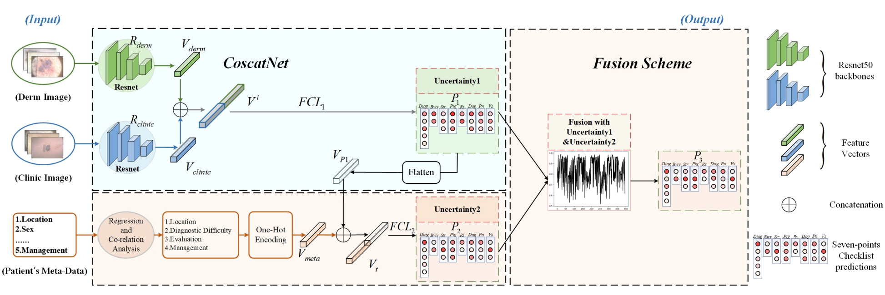

# CoscatNet-with-Uncertainty-FS: an adaptive fusion algorithm for multi-label multi-modality medical image classification task

## This project is the code for the `AIIM` paper: A multi-stage multi-modal learning algorithm with adaptive multimodal fusion for improving multi-label skin lesion classification.

### Abstract
Skin cancer is frequently occurring and is a new major contributor to both cancer incidence and mortality. Accurate and timely diagnosis of skin cancer holds the potential to save lives. Deep learning-based methods have demonstrated significant advancements in the screening of skin cancers. However, most current approaches rely on a single modality input for diagnosis, thereby missing out on valuable complementary information that could enhance accuracy. Although some multimodal-based methods exist, they often lack adaptability and fail to fully leverage multimodal information. In this paper, we introduce a novel uncertainty-based hybrid fusion strategy for a multi-modal learning algorithm aimed at skin cancer diagnosis. Our approach specifically combines three different modalities: clinical images, dermoscopy images, and metadata, to make the final classification. For the fusion of two image modalities, we employ an intermediate fusion strategy that considers the similarity between clinical and dermoscopy images to extract features containing both complementary and correlated information. To capture the correlated information, we utilize cosine similarity, and we employ concatenation as the means for integrating complementary information. In the fusion of image and metadata modalities, we leverage uncertainty to obtain confident late fusion results, allowing our method to adaptively combine the information from different modalities. We conducted comprehensive experiments using a popular publicly available skin disease diagnosis dataset, and the results of these experiments demonstrate the effectiveness of our proposed method. Our proposed fusion algorithm could enhance the clinical applicability of automated skin lesion classification, offering a more robust and adaptive way to make automatic diagnoses with the help of uncertainty mechanism.

#### Algorithm model: CoscatNet-with-Uncertainty-FS

#### What did we do in this paper?
The $contributions$ of this work are summarized as follows:

[1] We introduce a novel multi-stage, multi-modal learning algorithm for automated skin lesion classification, leveraging both clinical and dermoscopic images, as well as textual data. 

[2] We utilize the cosine similarity as an effective loss function to measure the relationships between features effectively.

[3] For the seamless integration of image and text modalities, we propose an adaptive multimodal fusion strategy.

[4] Comprehensive experiments on a public dataset underscore the efficacy of our proposed method. 
